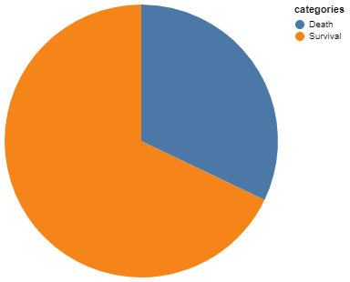
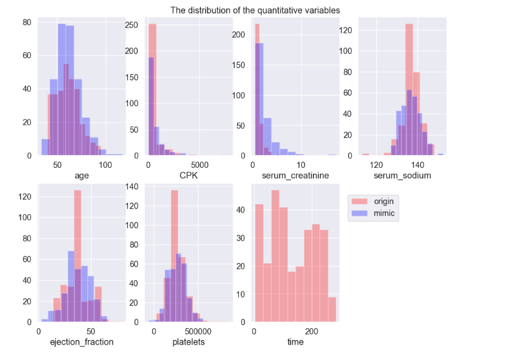
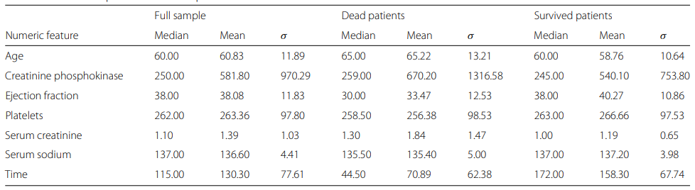
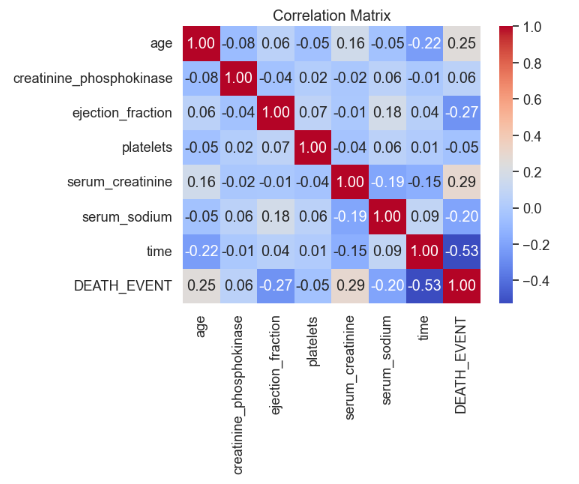

### Instroduce about dataset

#### Summary

This data set comprises the medical histories of 299 patients diagnosed with heart failure, and the target variable is `death_event`with each patient's profile containing 12 clinical attributes.

| variables                | Type       | description                                                   | values         |
|------------------|------------------|-------------------|------------------|
| age                      | Integer    | age of the patient (years)                                    | [40,95]        |
| anaemia                  | Binary     | decrease of red blood cells or hemoglobin                     | 0,1            |
| creatinine_phosphokinase | Integer    | level of the CPK enzyme in the blood(mcg/L)                   | [23,7861]      |
| diabetes                 | Binary     | if the patient has diabetes                                   | 0,1            |
| ejection_fraction        | Integer    | percentage of blood leaving the heart at each contraction (%) | [14,80]        |
| high_blood_pressure      | Binary     | if the patient has hypertension                               | 0,1            |
| platelets                | Continuous | platelets in the blood(kiloplatelets/mL)                      | [25100,850000] |
| serum_creatinine         | Continuous | level of serum creatinine in the blood (mg/dL)                | [0.5,9.4]      |
| serum_sodium             | Integer    | level of serum sodium in the blood (mEq/L)                    | [113,148]      |
| sex                      | Binary     | woman or man                                                  | 0,1            |
| smoking                  | Binary     | if the patient smokes or not                                  | 0,1            |
| time                     | Integer    | follow-up period (days)                                       | [4,285]        |
| death_event              | Binary     | if the patient died during the follow-up period               | 0,1            |

#### statistically descriptive analysis

Target:　As the pie plot shows below, our targeted variables `death_event` is unbalance with more survival observation than the dead one.

Quantitative Variables: we visualize 7 quantitative variables with histogram and fit each distribution of them, except \`time\` which has two peaks. The upper four plots comply to gamma distribution and the below to follow normal distribution:

