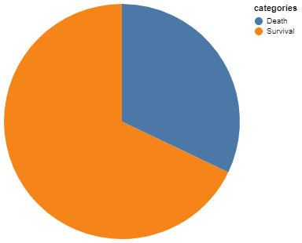
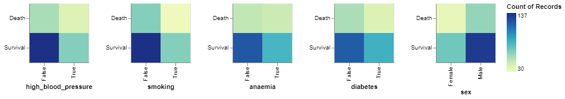

## Introduction and Motivation

Cardiovascular diseases (CVDs) are a group of disorders of the heart and blood vessels. Heart attacks and strokes are usually acute events and are mainly caused by a blockage that prevents blood from flowing to the heart or brain. The most common reason for this is a build-up of fatty deposits on the inner walls of the blood vessels that supply the heart or brain. Strokes can be caused by bleeding from a blood vessel in the brain or from blood clots.

We analysed a dataset collected on patients with left ventricular systolic dysfunction in April-December 2015 at the Faisalabad Institute of Cardiology and at the Allied Hospital in Faisalabad (Punjab, Pakistan). The data is from patients that are over 40 years old. The data was collected by cardiac echo report or notes written by the physician. The data set providers changed the names of some of the features of the original data set which can introduce a bias in the report. An underlying scientific process that may affect the data is that high blood pressure was not reported and the type of the follow up is not reported as well. This can affect the data analysis because those two variables are crucial to understanding heart disease.

With the analysis conducted on this data, we hope to answer some important scientific questions that will help in a better understanding, and the treatment of cardiovascular diseases.

## Data description

1.  Raw data

This dataset includes the medical histories of 299 patients diagnosed with heart failure, with the target variable being 'death_event'. As the *table 1* shows each patient's profile consists of 13 clinical attributes, 5 categorical variables and 7 numerical variables.

| variables                | Type       | description                                                   | values         |
|----------------|----------------|-------------------------|----------------|
| age                      | Integer    | age of the patient (years)                                    | [40,95]        |
| anaemia                  | Binary     | decrease of red blood cells or hemoglobin                     | 0,1            |
| creatinine_phosphokinase | Integer    | level of the CPK enzyme in the blood(mcg/L)                   | [23,7861]      |
| diabetes                 | Binary     | if the patient has diabetes                                   | 0,1            |
| ejection_fraction        | Integer    | percentage of blood leaving the heart at each contraction (%) | [14,80]        |
| high_blood_pressure      | Binary     | if the patient has hypertension                               | 0,1            |
| platelets                | Continuous | platelets in the blood(kiloplatelets/mL)                      | [25100,850000] |
| serum_creatinine         | Continuous | level of serum creatinine in the blood (mg/dL)                | [0.5,9.4]      |
| serum_sodium             | Integer    | level of serum sodium in the blood (mEq/L)                    | [113,148]      |
| sex                      | Binary     | woman or man                                                  | 0,1            |
| smoking                  | Binary     | if the patient smokes or not                                  | 0,1            |
| time                     | Integer    | follow-up period (days)                                       | [4,285]        |
| death_event              | Binary     | if the patient died during the follow-up period               | 0,1            |

[Table 1. A table provides a description of the variables included in the dataset. The variables are categorized by type, including Integer, Binary, and Continuous, along with a brief description of each variable's meaning. The 'values' column indicates the range or possible values for each variable.]{width="321"}

1.1 Target variable

As Figure 1 shows below, our targeted variables `death_event` is unbalanced with 203 survival observations vs 96 dead observations.

{width="321"}

1.2 Numerical variables

As the Figure 2 shows, these variables exhibit different scales, indicating the need for standardization. Based on descriptive statistics, the variables do not appear to have significant differences between the deceased and surviving groups, except for **`time`**.

1.3 Categorical variables

We visualize 5 categorical variables against the target variable "death_event." As Figure 3 shows below, the number of males is larger than females, and individuals with a history of 'anaemia,' 'high blood pressure,' 'diabetes,' and 'smoking' are more prevalent than those without such histories. These variables demonstrate bias. Therefore, we need to perform oversampling to preprocess our data.

{width="609" height="149"}

2.  Data Preprocessing

[**2.1 Standardization**]{.underline}

Based on Table 1 and Figure 2, the numerical variables have vastly different scales, so we need to scale our data to prevent some features with larger scales from dominating the learning process. Also, we can observe the presence of outliers in the data. Therefore, choosing Z-score Normalization would be a suitable method for standardization. Additionally, from the distribution of continuous variables, it is evident that the distribution of data varies with different values of the target variable for some continuous variables. Z-score Normalization can effectively preserve the information about the original variable distributions.

Mathematically, for a feature $X$, the Z-score normalization formula is:

$$ Z = \frac{(X - \mu)}{\sigma} $$

Where:

-   $Z$ is the standardized value (Z-score).

-   $X$ is the original data point.

-   $\mu$ is the mean of the feature.

-   $\sigma$ is the standard deviation of the feature.

The resulting Z-scores have a mean of 0 and a standard deviation of 1, making it easier to compare and interpret different features with varying scales.

[**2.2 Oversampling**]{.underline}

As Figure 1 shows, there is a huge imbalance in the response variable `death_event` with 203 survival observations vs 96 dead observations. Dealing with imbalanced datasets poses a challenge because the majority of machine learning methods tend to overlook the minority class, resulting in poor prediction. Hence, we will attempt to balance using the SMOTE (Synthetic Minority Oversampling Technique) algorithm.

SMOTE works by synthesizing new samples of the minority class to balance the disparate sample sizes between different classes. The core idea of the SMOTE algorithm is to generate synthetic samples by interpolating between existing minority class samples, thus increasing the quantity of minority class samples and creating a more balanced distribution between the minority and majority classes.

As shown in Figure 4, even after oversampling, each category of response remains equal (203 occurrences each), yet the distribution of categorical variables remains uneven, except for the variable 'anaemia'

{width="609" height="149"}

## Scientific Hypotheses Discussion

The medical dataset at hand contains valuable information and can help in answering some crucial questions, and understanding trends that provide useful insights about patient\'s health. It has great applications in a predictive landscape, and we will try to use the predictors and create models to make predictions.

Using this dataset, we will start our analysis by understanding the different factors and how they influence our understanding of cardiovascular diseases. We will primarily focus on finding out what predictors are the most relevant in predicting patients\' death due to a heart attack. Then we will also attempt to predict whether the patient dies in the follow up period by leveraging predictive models and machine learning algorithms.

This should hold numerous applications in the medical landscape. The scientific questions that we will attempt to answer using our analysis are discussed below:

**1. Out of all the predictors available, which of them are significant in determining whether the patient dies within the follow up period?**

-   Identifying the key clinical variables associated with the risk of death is crucial for understanding disease progression and tailoring treatment plans. It can guide clinicians in prioritizing interventions and monitoring strategies for at-risk patients.

-   Heart failure is characterized by complex mechanisms and is affected differently by different clinical factors. Hence, having a better understanding of what predictors are significant would prove to be vital information to any physician.

-   Having the answer to this question would have a great significance in the problem that we are trying to solve with this project.

**2. Can we predict the likelihood of death during the follow-up period based on the patient\'s clinical attributes?**

-   Heart failure is a condition that presents with various complications and clinical presentations. Predicting the likelihood of death due to heart failure during the follow-up period can prove to be crucial.

-   This question is of great importance in clinical practice as it helps healthcare providers identify patients at higher risk of mortality, allowing for timely interventions and personalized treatment strategies.

-   By identifying patients at higher risk of mortality, healthcare providers can implement targeted interventions and monitor the disease progression more closely. It will also have applications in adjusting the follow-up period of the patients accordingly.

# Feature selection

As shown in Figure 5, there exists some correlation between variables. We will conduct feature selection to identify the most important variables for model prediction.

1.  Z-test

A Z-test is a statistical method used to assess whether there's a significant difference between the means of the populations under consideration. By formulating the null hypothesis (`H0`) suggests that the population means are equal. Next, the test statistic (`Z`) is calculated using the formula:

$$ Z = \frac{{\bar{X}_1 - \bar{X}_2}}{{\sqrt{\frac{{\sigma_1^2}}{{n_1}} + \frac{{\sigma_2^2}}{{n_2}}}}} $$

Here, $\bar{X}_1$ and $\bar{X}_2$ represent the sample means of the two populations, while $\sigma_1$ and $\sigma_2$ denote the known population standard deviations. $n_1$ and $n_2$ are the sample sizes for the respective populations.

As we can see on the table 3, variable `time` has significant high z-score and `ejection_fraction`, `age` and `serum_creatinine` are the following important variables

# Model

Extreme Gradient Boosting (XGBoost) is an ensemble learning method that employs gradient boosting to train decision trees sequentially. The optimal parameters obtained through grid search are ('colsample_bytree': 0.6, 'learning_rate': 0.1, 'max_depth': 3, 'n_estimators': 150, 'subsample': 0.8)

Generalized Additive Models (GAMs) are a class of generalized linear models that allow for flexible modeling of non-linear relationships. The model utilized B-spline basis functions with the number of degrees of freedom (df) and degrees of the spline set to [3, 3, 4, 4, 4, 3, 4] and [2, 2, 3, 3, 3, 2, 3], respectively, allowing for the capture of non-linear relationships between the predictors ['age', 'creatinine_phosphokinase', 'ejection_fraction', 'platelets', 'serum_creatinine', 'serum_sodium', 'time'] and the response variable.

# Result
