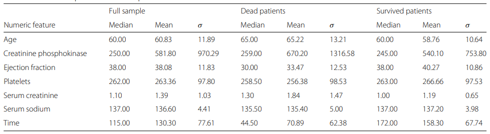

# Cardiovascular Diseases Classification

## Instroduce about dataset

### Summary

This dataset includes the medical histories of 299 patients diagnosed with heart failure, with the target variable being 'death_event.' Each patient's profile consists of 13 clinical attributes.

| variables                | Type       | description                                                   | values         |
|------------------|------------------|-------------------|------------------|
| age                      | Integer    | age of the patient (years)                                    | [40,95]        |
| anaemia                  | Binary     | decrease of red blood cells or hemoglobin                     | 0,1            |
| creatinine_phosphokinase | Integer    | level of the CPK enzyme in the blood(mcg/L)                   | [23,7861]      |
| diabetes                 | Binary     | if the patient has diabetes                                   | 0,1            |
| ejection_fraction        | Integer    | percentage of blood leaving the heart at each contraction (%) | [14,80]        |
| high_blood_pressure      | Binary     | if the patient has hypertension                               | 0,1            |
| platelets                | Continuous | platelets in the blood(kiloplatelets/mL)                      | [25100,850000] |
| serum_creatinine         | Continuous | level of serum creatinine in the blood (mg/dL)                | [0.5,9.4]      |
| serum_sodium             | Integer    | level of serum sodium in the blood (mEq/L)                    | [113,148]      |
| sex                      | Binary     | woman or man                                                  | 0,1            |
| smoking                  | Binary     | if the patient smokes or not                                  | 0,1            |
| time                     | Integer    | follow-up period (days)                                       | [4,285]        |
| death_event              | Binary     | if the patient died during the follow-up period               | 0,1            |

### statistically descriptive analysis

Target: As the pie plot shows below, our targeted variable `death_event` is unbalanced with 203 survival observations vs 96 dead observations.

  

#### Quantitative Variables

We visualize 7 quantitative variables with histograms and fit each distribution of them, except for 'time,' which has two peaks. The upper four plots comply with the gamma distribution, and the lower ones follow the normal distribution.

  

As shown in the table below, these variables exhibit different scales, indicating the need for standardization. Based on descriptive statistics, the variables do not appear to have significant differences between the deceased and surviving groups, except for **`time`**.

  

Combined with the correlation matrix, we can also observe a stronger relationship between the follow-up time and the target variable.

  

#### Categorical Variables

We visualize 5 categorical variables against the target variable "death_event." As the plots indicate, in our dataset, the number of males is larger than females, and individuals with a history of 'anaemia,' 'high blood pressure,' 'diabetes,' and 'smoking' are more prevalent than those without such histories. These variables demonstrate bias. Therefore, we need to perform oversampling to preprocess our data.

  

